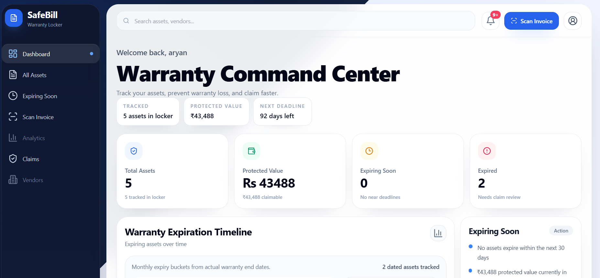
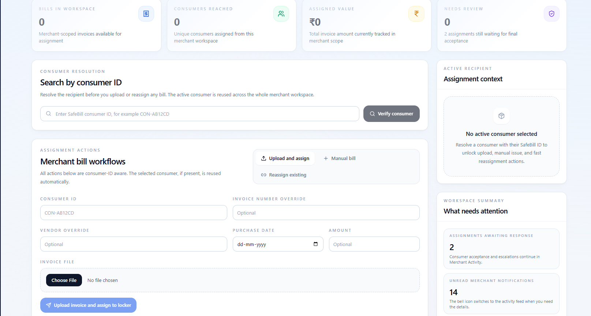
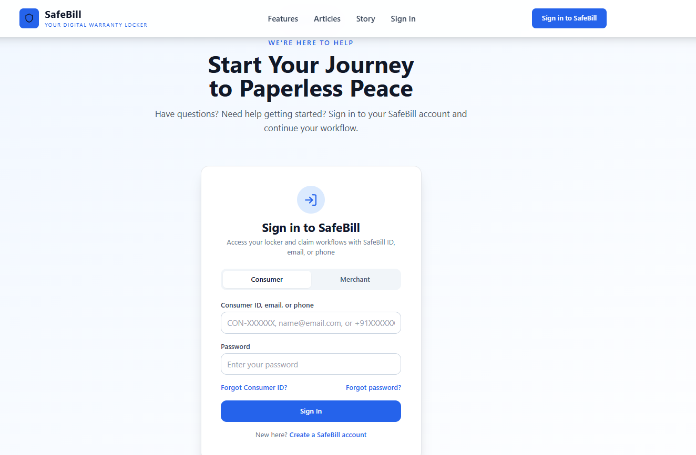
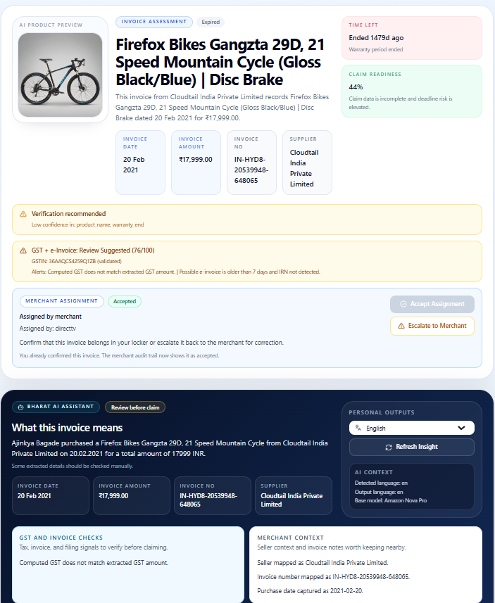

# SafeBill

SafeBill is a warranty locker and invoice intelligence platform that helps consumers and merchants store bills, extract structured data, and stay ahead of warranty deadlines. The repo is a monorepo with a Next.js web app and a FastAPI backend.

## Product Snapshots

## What It Does

- OCR and metadata extraction for invoices and warranty documents
- Consumer warranty locker with reminders and claim readiness insights
- Merchant bill assignment workflow to consumers
- AI-powered summaries and insights for invoices
- Secure document storage and sharing

## Repository Layout

- `nextjs-app/` -- Next.js app (consumer + merchant portals) and BFF `/api/*` proxy routes
- `backend/` -- FastAPI ingestion/RAG API, extraction pipeline, and notifications
- `deploy/` -- EC2 deployment assets and infrastructure references

## AWS Tech Stack (Brief)

SafeBill is deployed on AWS using a managed stack for identity, storage, AI inference, and messaging:

Amazon Cognito — Central identity provider for both consumers and merchants. It manages sign‑up, login, password resets, and issues JWTs that the
    backend validates for role‑based access to bills, assignments, and settings.
  - Amazon S3 — Durable object store for raw invoices, uploaded images, and OCR text snapshots. The backend writes files to S3 and generates presigned URLs
    for secure, time‑limited access from the UI.
  - Amazon Bedrock — Hosts the LLM (AMAZON NOVA PRO) used for text‑to‑schema extraction (invoice fields, product names, GST info), plus narrative insight generation. It
    converts OCR text into structured metadata used throughout the app.
  - Amazon Textract / Google Vision OCR — OCR layer for extracting text from scanned bills and PDFs. The backend chooses the best OCR output, then feeds it into
    deterministic parsing and LLM mapping.
  - Amazon SES — Transactional email delivery for warranty reminders, merchant assignment updates, and claim readiness alerts. It uses a verified sender
    domain with DKIM for deliverability.
  - Amazon SNS — Optional multi‑channel delivery layer for SMS/WhatsApp/push notifications when enabled. It’s wired in the backend as a provider for
    non‑email alerts.
  - Amazon RDS (Postgres) — Primary relational store for users, documents, extracted metadata, assignments, reviews, and notifications. This is the single
    source of truth for the product state.
  - EC2 + Docker Compose — Runtime hosting for both backend and frontend containers. Compose manages service lifecycle, networking, and environment
    configuration on the EC2 instance.
  - Amazon Titan used for image generation for the scanned bills.

## Contributions

Contributions are welcome. Please open an issue to discuss major changes before submitting a PR. For smaller fixes, submit a PR directly with a concise description and screenshots if UI behavior changes.
