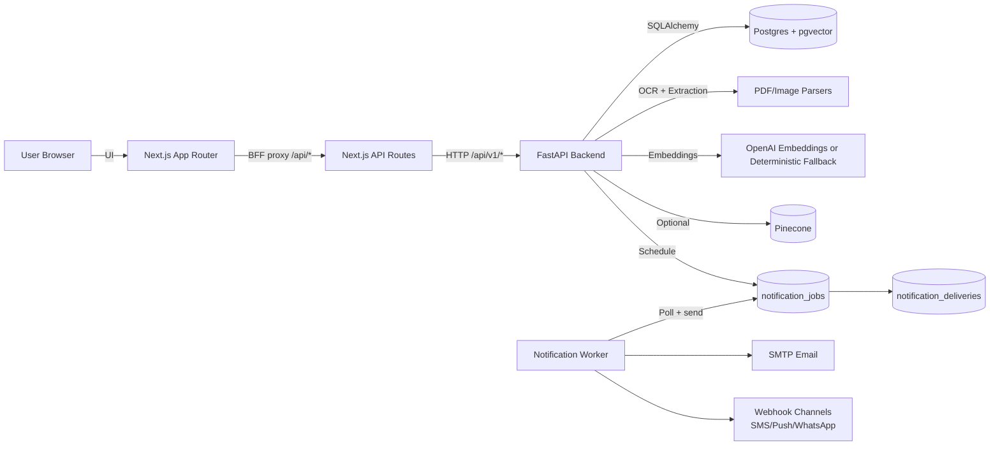
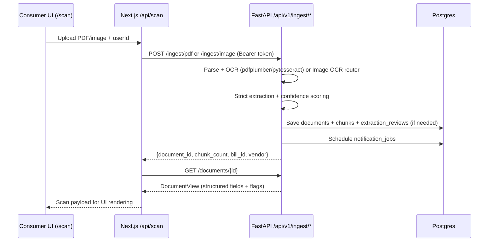
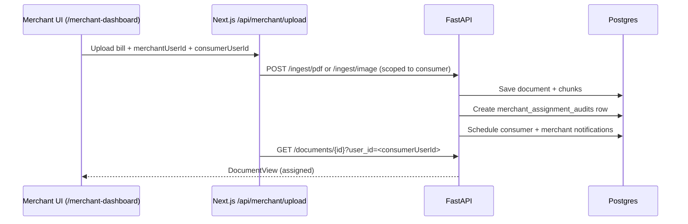

# SafeBill (SafeBill Locker + RAG API)

SafeBill is a full-stack warranty locker for consumers and merchants. It scans invoices (PDF/images), extracts structured warranty fields with confidence scoring, stores the raw + structured data, and powers a grounded Q&A (RAG) experience with citations. It also schedules reminder notifications and includes India-first GST/e-invoice compliance heuristics plus pincode-aware service-center lookup.

This repository is a monorepo:

- `nextjs-app/`: Next.js 14 web app (Consumer + Merchant portals) and `/api/*` BFF proxy routes
- `backend/`: FastAPI RAG + ingestion API, Postgres/pgvector storage, and a notification worker

## Architecture



### Key design choices (what matters)

- **BFF proxy layer**: the web app calls `nextjs-app/app/api/*`, which forwards to the backend (`backend/app/api/routes.py`) and attaches auth headers.
- **Strict extraction**: image extraction uses OpenAI Vision with `response_format=json_object` and a "do not guess; use null" system prompt. All extraction outputs are coerced into a strict Pydantic schema (`backend/app/services/extraction_pipeline.py`).
- **Confidence + review queue**: extraction produces per-field confidences; low-confidence fields trigger an `extraction_reviews` row for user confirmation.
- **Hybrid retrieval (RAG)**: pgvector cosine similarity + Postgres full-text search are combined; Pinecone is optional and will fail open to pgvector (`backend/app/services/retrieval.py`, `backend/app/services/vector_store.py`).
- **Deliverability tracking**: every send attempt is recorded (`notification_deliveries`), and analytics/deliverability endpoints are available.

## Repository layout

```
.
|-- backend/
|   |-- app/                      # FastAPI app, services, models
|   |-- scripts/                  # init_db, notification_worker, eval runners
|   |-- sql/                      # schema + feature DDL (pgvector, hybrid search, notifications)
|   |-- tests/                    # backend tests (pytest)
|   |-- openapi.yaml              # API contract snapshot
|   `-- .env.example              # backend environment template
|-- nextjs-app/
|   |-- app/                      # Next.js routes (UI) + app/api/* (BFF)
|   |-- components/               # UI components (GSAP helpers used for motion)
|   |-- lib/                      # backend-api.ts, supabase clients, types
|   |-- public/                   # static assets
|   `-- .env.local.example        # frontend environment template
|-- dev.ps1                       # launches backend + worker + frontend (Windows)
`-- dev.cmd
```

## Local development (recommended)

### Prerequisites

- Node.js 18+
- Python 3.10+ (3.11 recommended)
- Postgres with extensions: `vector` (pgvector), `pg_trgm`, `pgcrypto`
- (Optional) Tesseract OCR installed locally if you want image/PDF OCR via pytesseract
- A Supabase project for auth (`NEXT_PUBLIC_SUPABASE_URL`, `NEXT_PUBLIC_SUPABASE_ANON_KEY`)
- (Optional) OpenAI API key for best extraction + embeddings + grounded answer generation

### 1) Configure backend env

Copy and fill:

```powershell
Copy-Item backend/.env.example backend/.env
```

Minimum variables for a real run:

- `DATABASE_URL` (Postgres)
- `CORS_ALLOWED_ORIGINS` (usually `http://localhost:3000`)
- `SUPABASE_URL` (for backend JWT verification via JWKS)
- `OPENAI_API_KEY` (recommended)

### 2) Configure frontend env

```powershell
Copy-Item nextjs-app/.env.local.example nextjs-app/.env.local
```

Minimum variables:

- `NEXT_PUBLIC_SUPABASE_URL`
- `NEXT_PUBLIC_SUPABASE_ANON_KEY`
- `SUPABASE_SERVICE_ROLE_KEY` (required for `/api/auth/lookup-id`)
- `BACKEND_API_BASE_URL` (default `http://localhost:8000`)

### 3) Install dependencies

Backend:

```powershell
cd backend
python -m pip install -r requirements.txt
```

Frontend:

```powershell
cd nextjs-app
npm install
```

### 4) Run the full stack

From repo root:

```powershell
.\dev.cmd
```

This will:

- run `python -m scripts.init_db` (applies `backend/sql/*.sql`)
- start FastAPI on `http://localhost:8000`
- start the notification worker (due-queue processor)
- start Next.js on `http://localhost:3000`

## Configuration reference

The canonical templates live in:

- `backend/.env.example`
- `nextjs-app/.env.local.example`

All backend `Settings` fields in `backend/app/core/config.py` can also be overridden via env vars (uppercase names),
even if they are not listed in `.env.example`.

### Backend (`backend/.env`)

Core:

- `DATABASE_URL`: Postgres connection string (SQLAlchemy URL)
- `CORS_ALLOWED_ORIGINS`: comma-separated list (example: `http://localhost:3000`)
- `CORS_ALLOW_CREDENTIALS`: `true|false` (only effective when origins are not `*`)

OpenAI / RAG:

- `OPENAI_API_KEY`: enables Vision extraction, embeddings, and grounded answer generation
- `OPENAI_CHAT_MODEL`: used for chat completions (and Vision extraction via `chat/completions`)
- `OPENAI_EMBEDDING_MODEL`: used for embeddings
- `EMBEDDING_DIMENSIONS`: must match your pgvector column and embedding model output

Retrieval (optional):

- `USE_PINECONE`: `true|false`
- `PINECONE_API_KEY`, `PINECONE_INDEX_NAME`, `PINECONE_NAMESPACE`

OCR / extraction:

- `OCR_ENABLED`: enable OCR fallback paths
- `TESSERACT_CMD`: optional absolute path to the `tesseract` binary
- `USE_UNSTRUCTURED_PARTITION`: enable optional `unstructured` PDF partitioning
- `TEXTRACT_PROXY_URL`, `TEXTRACT_PROXY_API_KEY`: optional AWS Textract proxy for the image router
- `DOCAI_PROXY_URL`, `DOCAI_PROXY_API_KEY`: optional Google DocAI proxy for the image router

India market features:

- `ENABLE_GOOGLE_SERVICE_CENTER_LOOKUP`: enable Google Places lookup
- `GOOGLE_MAPS_API_KEY`: required when Google lookup is enabled
- `SERVICE_CENTER_DIRECTORY_PATH`: override for the curated directory JSON (default is in `backend/app/data/`)

Security / guardrails:

- `PROMPT_INJECTION_BLOCKING`: blocks known injection patterns on `/ask` and similar endpoints
- Rate limiting:
  - `API_RATE_LIMIT_WINDOW_SECONDS`
  - `API_RATE_LIMIT_ASK_PER_WINDOW`
  - `API_RATE_LIMIT_INGEST_PER_WINDOW`
  - `API_RATE_LIMIT_NOTIFICATION_PER_WINDOW`

Notifications:

- Channel toggles: `EMAIL_NOTIFICATIONS_ENABLED`, `SMS_NOTIFICATIONS_ENABLED`, `PUSH_NOTIFICATIONS_ENABLED`, `WHATSAPP_NOTIFICATIONS_ENABLED`
- SMTP: `SMTP_HOST`, `SMTP_PORT`, `SMTP_USERNAME`, `SMTP_PASSWORD`, `SMTP_USE_TLS`, `SMTP_USE_SSL`, `EMAIL_FROM`, `EMAIL_FROM_NAME`
- Webhooks: `SMS_WEBHOOK_URL`, `PUSH_WEBHOOK_URL`, `WHATSAPP_WEBHOOK_URL`, `NOTIFICATION_WEBHOOK_SECRET`
- Worker: `NOTIFICATION_WORKER_POLL_SECONDS`, `NOTIFICATION_WORKER_BATCH_SIZE`, retry/backoff settings

Supabase JWT verification:

- `SUPABASE_URL`
- `SUPABASE_JWT_ISSUER` (optional; defaults based on `SUPABASE_URL`)
- `SUPABASE_JWT_AUDIENCE` (default `authenticated`)

### Frontend (`nextjs-app/.env.local`)

- `NEXT_PUBLIC_SUPABASE_URL`, `NEXT_PUBLIC_SUPABASE_ANON_KEY`: Supabase client configuration
- `SUPABASE_SERVICE_ROLE_KEY`: required for `/api/auth/lookup-id` (server-side admin lookup)
- `NEXT_PUBLIC_APP_API_BASE_URL`: usually `/api` (Next.js BFF)
- `BACKEND_API_BASE_URL`: backend origin (example: `http://localhost:8000`)
- `BACKEND_API_SERVICE_TOKEN`: optional server-side fallback token (keep empty in production)
- `BACKEND_API_TIMEOUT_MS`: proxy timeout in milliseconds

## Authentication model

### Frontend (Next.js)

- Uses Supabase Auth in the UI (`nextjs-app/lib/supabase.ts`).
- On successful login, the client sets cookies:
  - `sb_access_token`: Supabase access token (JWT)
  - `sb_user_type`: `consumer` or `merchant`
- `nextjs-app/middleware.ts` protects routes like `/locker`, `/scan`, `/merchant-dashboard` based on those cookies.

### Backend (FastAPI)

Backend authorization accepts:

- A static token mapped to a role (dev-friendly) via `Settings.auth_tokens` (`backend/app/core/config.py`), provided as:
  - `Authorization: Bearer <token>` or
  - `x-api-key: <token>`
- A Supabase JWT (RS256) verified via JWKS (`backend/app/core/security.py`)

The backend derives `Principal.role` from the token:

- static: `admin | analyst | auditor | viewer`
- JWT: `consumer` or `merchant` (from `user_metadata` / `app_metadata`)

## Core workflows

### Consumer: scan -> extraction -> locker



Implementation notes:

- Image ingestion rejects app screenshots (to avoid garbage extraction). If OCR text looks like the SafeBill UI and no strong invoice engine ran, the API returns HTTP 422 with a "not a bill/invoice" message (`backend/app/api/routes.py`).
- Extraction output is always coerced into a strict schema (`ensure_strict_extraction`) and includes field-level confidence (`compute_field_confidences`).
- Low-confidence fields trigger an `extraction_reviews` row; confirmed fields can be pushed back via `PUT /api/v1/extraction-reviews/{id}`.

### Merchant: upload + assign to consumer



Consumer acknowledgement is supported via `POST /api/v1/documents/{doc_id}/assignment/ack`, which updates the audit trail and stores `consumer_activated_at` in document references.

### Reminders + deadline "traffic light" tones

The backend exposes:

- `GET /api/v1/reminders` which computes `daysRemaining` and an `urgencyTone`:
  - `stable`: more than 30 days remaining
  - `watch`: 8-30 days
  - `critical`: 1-7 days
  - `expired`: 0 or fewer days

These tones are meant to drive your UI colors (green/yellow/red) without showing "hard/medium/easy" labels.

### Notifications (in-app + email + webhooks)

Notifications are stored and processed as durable jobs:

- `notification_jobs`: the queue (email, sms, push, whatsapp, in_app)
- `notification_deliveries`: each send attempt + status + latency
- `notification_events`: scheduled events (claim window closing, warranty expiry, suspicious/duplicate, etc)

Processing:

- Worker: `python -m scripts.notification_worker`
- API: `POST /api/v1/notifications/process-due` (admin/analyst) to process on-demand

Channels:

- **Email** via SMTP (`SMTP_HOST`, `SMTP_USERNAME`, `SMTP_PASSWORD`, `EMAIL_FROM`)
- **SMS/Push/WhatsApp** via configured webhook URLs + optional HMAC signature (`NOTIFICATION_WEBHOOK_SECRET`)
- **In-app** is persisted as jobs with `channel=in_app` and served via `GET /api/v1/notifications`

### Grounded Q&A (RAG) with citations + QA logging

```mermaid
flowchart TD
  Q[User question] -->|/api/chat| ASK[/api/v1/ask]
  ASK --> PLAN[QueryPlanner]
  ASK --> RET[HybridRetriever\npgvector + FTS\n(optional Pinecone)]
  RET --> CALC[CalculationAgent]
  RET --> POL[PolicyAgent]
  RET --> GEN[GroundedAnswerGenerator\n(OpenAI or fallback)]
  GEN --> AUD[AuditorAgent]
  AUD --> LOG[qa_logs]
  AUD --> OUT[Answer + claims + citations + confidence]
```

Important: if `OPENAI_API_KEY` is not set, the backend will:

- generate deterministic embeddings (so retrieval still works, but is weaker)
- return a fallback grounded answer generator output (still citation-based, but less fluent)

### India-first: GST + e-invoice compliance heuristics

`validate_invoice_compliance()` (`backend/app/services/gst_compliance.py`) computes:

- GSTIN format + checksum validation
- Rule-46 field presence checks
- tax split sanity checks (CGST/SGST vs IGST)
- heuristic IRN/QR detection and "late reporting risk"
- pincode detection when present

The output includes a `score` (0-100), `status` (`pass|watch|risk`), and `alerts[]` with severity.

### Pincode-aware service-center lookup

`ServiceCenterLocator` (`backend/app/services/service_centers.py`) can:

- search a curated directory (`backend/app/data/service_center_directory.json`)
- fall back to OpenStreetMap (Overpass/Nominatim)
- optionally use Google Places text search when enabled (`ENABLE_GOOGLE_SERVICE_CENTER_LOOKUP=true` + `GOOGLE_MAPS_API_KEY`)

It supports location hints (city/state/pincode) and returns distance + pickup/TAT heuristics.

## API surface

Backend base path: `http://localhost:8000/api/v1`

Source-of-truth contract snapshot: `backend/openapi.yaml`

High-traffic endpoints (non-exhaustive):

- Ingestion:
  - `POST /ingest/pdf`
  - `POST /ingest/image`
- Documents:
  - `GET /documents`
  - `GET /documents/{doc_id}`
  - `DELETE /documents/{doc_id}`
  - `GET /documents/{doc_id}/calendar-links`
  - `GET /documents/{doc_id}/calendar.ics`
  - `GET /documents/{doc_id}/claim-packet`
- RAG:
  - `POST /ask`
  - `POST /search`
- Extraction review queue:
  - `GET /extraction-reviews`
  - `GET /extraction-reviews/{review_id}`
  - `PUT /extraction-reviews/{review_id}`
- Merchant:
  - `POST /merchant/manual-bill`
  - `GET /merchant/activity`
  - `POST /merchant/documents/{doc_id}/assign`
  - `POST /documents/{doc_id}/assignment/ack`
- Reminders + notifications:
  - `GET /reminders`
  - `GET /notifications`
  - `POST /notifications/{id}/read`
  - `PUT /notifications/preferences`
  - `GET /notifications/analytics`
  - `GET /notifications/deliverability`

## Data model (what is stored)

Core tables (see `backend/app/models.py` and `backend/sql/*.sql`):

- `documents`: one logical invoice (versioned) + `references` JSON for app-level fields (user_id, merchant_user_id, metadata flags, etc)
- `chunks`: retrieval units with `embedding_vector` + FTS `tsv`
- `extraction_reviews`: field-level confidence + confirmed_fields workflow
- `merchant_assignment_audits`: assignment lifecycle + acceptance/escalation
- `notification_preferences`: per-user channel config + alert day rules
- `notification_jobs`: durable send queue (includes in-app)
- `notification_deliveries`: per-attempt deliverability records
- `notification_events`: higher-level scheduled events
- `qa_logs`: QA + hallucination/grounding metrics for each ask()
- `security_audit_logs`: security and lifecycle audit trail

## Testing and evals

Backend:

```powershell
cd backend
python -m pytest -q
# If you have make installed:
# make test
```

Extraction regression evals (gold dataset):

```powershell
cd backend
python -m scripts.run_extraction_evals --dataset evals/gold_invoices.jsonl --min-accuracy 0.80
```

Adversarial prompt-injection checks against a running backend:

```powershell
cd backend
python scripts/adversarial_query_tests.py --base-url http://localhost:8000 --token safebill-analyst-token
# If you have make installed:
# make adversarial
```

Frontend:

```powershell
cd nextjs-app
npm run lint
npm run build
```

## Troubleshooting

### 401 Unauthorized from backend

- Ensure the browser has `sb_access_token` (Supabase access token) set.
- Ensure backend Supabase verification is configured (`SUPABASE_URL`, `SUPABASE_JWT_ISSUER`, `SUPABASE_JWT_AUDIENCE`).
- For local dev-only bypass, you can set `BACKEND_API_SERVICE_TOKEN` on the frontend to a static token from `Settings.auth_tokens` (default includes `safebill-analyst-token`).

### DB init fails on extensions

`scripts.init_db` executes `CREATE EXTENSION IF NOT EXISTS vector;` etc.

- Install pgvector on your Postgres instance.
- Ensure your DB user has privileges to create extensions.

### OCR quality is poor

- Prefer a clean PDF export over screenshots.
- For image OCR, install Tesseract and set `TESSERACT_CMD` in `backend/.env` if needed.
- The image ingestion API will reject app UI screenshots with HTTP 422 (by design).

### OpenAI features are not active

- Set `OPENAI_API_KEY` in `backend/.env`.
- Without it, embeddings and answer generation fall back to deterministic/local logic (functional but less accurate).

## Deployment notes

Frontend deployment docs live in:

- `nextjs-app/DEPLOYMENT.md`
- `nextjs-app/QUICK_DEPLOY.md`
- `nextjs-app/vercel.json`

Backend deployment requirements:

- A Postgres database with pgvector + extensions
- Environment variables from `backend/.env.example`
- If you enable outbound notifications (email/SMS/push/WhatsApp), run the notification worker (`python -m scripts.notification_worker`).
- Alternatively, the API will run an in-process due-job loop when outbound channels are enabled; set `DISABLE_IN_APP_NOTIFICATION_WORKER=true` to force external worker-only mode.
