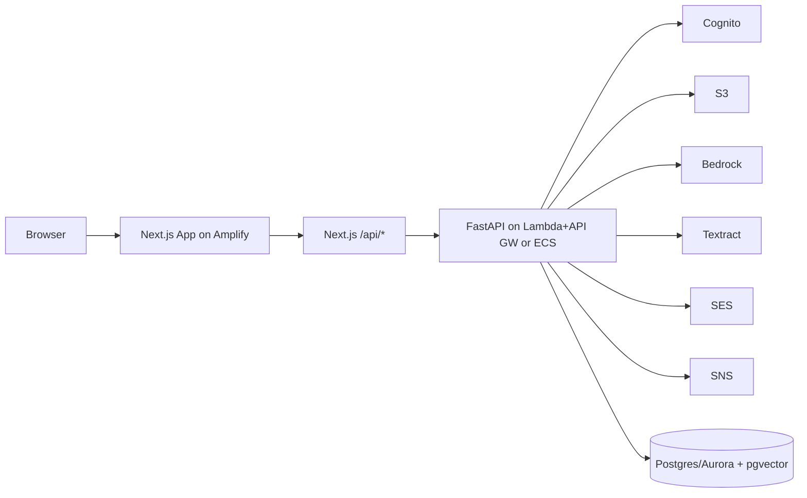

# SafeBill (AWS-Only Stack)

SafeBill is a warranty locker + invoice intelligence platform built as a monorepo:

- `nextjs-app/` - Next.js web app (consumer + merchant portals) and BFF `/api/*` proxy routes
- `backend/` - FastAPI ingestion/RAG API and notification processing

This repository is now configured for **AWS-only integration**.

## AWS Services Used

- **Amazon Cognito**: authentication and JWT identity
- **Amazon S3**: invoice/document object storage + presigned download links
- **Amazon Bedrock**: metadata generation, embeddings, grounded answer generation
- **Amazon Textract**: OCR and expense extraction for images
- **Amazon SES**: email delivery
- **Amazon SNS**: SMS/push/WhatsApp publish channels
- **AWS Secrets Manager + SSM Parameter Store**: runtime configuration injection
- **API Gateway + Lambda** (or **ECS Fargate**): backend runtime options
- **AWS Amplify Hosting**: Next.js frontend hosting

## Architecture



## AWS-Only Enforcement

Backend includes strict validation in `AWS_ONLY_MODE=true`:

- Provider checks:
  - `AUTH_PROVIDER=cognito`
  - `AI_PROVIDER=bedrock`
  - `STORAGE_PROVIDER=s3`
  - `EMAIL_PROVIDER=ses`
  - `SMS_PROVIDER=sns`
  - `PUSH_PROVIDER=sns`
  - `WHATSAPP_PROVIDER=sns`
- Required settings checks:
  - `AWS_REGION`
  - `COGNITO_USER_POOL_ID`
  - `COGNITO_APP_CLIENT_ID`
  - `S3_BUCKET_NAME`
  - `BEDROCK_CHAT_MODEL`
  - `BEDROCK_EMBEDDING_MODEL`
- Non-AWS model fallbacks are disabled in AWS-only mode.

## Deploy

- Backend AWS deployment: `backend/infra/AWS_DEPLOY.md`
- Frontend AWS deployment: `nextjs-app/DEPLOYMENT.md`
- Frontend quick start: `nextjs-app/QUICK_DEPLOY.md`
- EC2 single-instance deployment: `deploy/ec2/README.md`

## Local Setup

### Backend

```powershell
Copy-Item backend/.env.example backend/.env
cd backend
python -m pip install -r requirements.txt
```

### Frontend

```powershell
Copy-Item nextjs-app/.env.local.example nextjs-app/.env.local
cd nextjs-app
npm install
```

Run backend and frontend with your existing local workflow.

## Important Notes

- This migration updates code and IaC/docs for AWS-only operation.
- Actual cloud cutover still requires applying infrastructure in your AWS account and setting all environment variables/secrets there.
